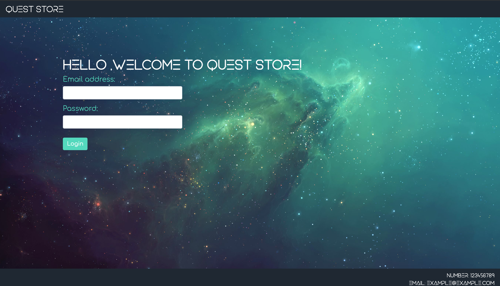

# QuestStore

We present you our take on Codecool management system. Our app is dedicated to provide various tools to help mentors and students throughout whole course.
# Admin tools:
- manage mentors
- manage classes
- manage levels of experience
# Mentor tools:
- manage students
- manage quests and rewards
# Student tools:
- Earn coolcoins and spend them on various rewards
- Follow your progress
- update your profile

# Learning goals:
- web development basics
- PostgresSQL
- remote database with ElephantSQL
- HTML/CSS/JS
- JTwig template engine
- working with agile methodology

